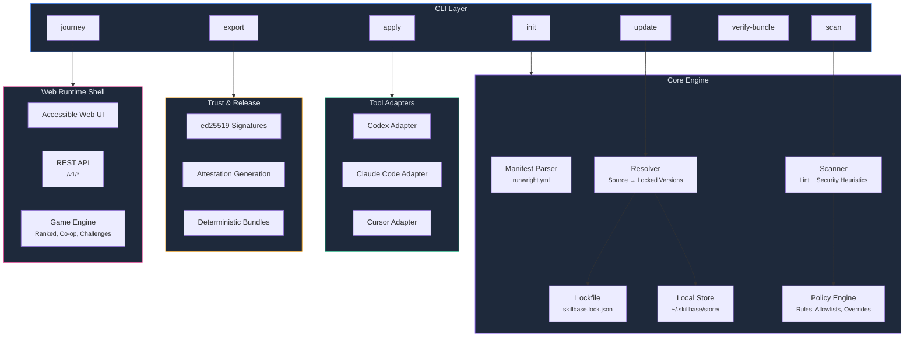
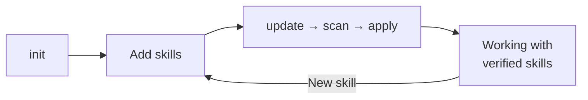
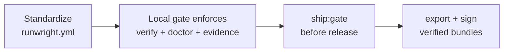
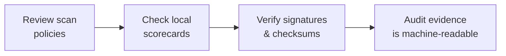

<p align="center">
  
  
  
</p>

<h1 align="center">Runwright</h1>

<p align="center">
  <strong>Policy-first skill distribution for AI coding tools.</strong><br/>
  Define once. Scan for risk. Apply everywhere.
</p>

<p align="center">
  <strong>Local-first quality gates:</strong> `pnpm ci:local` on every push, `pnpm ci:local:full` before release.
</p>

---

## The Problem

AI coding tools — Codex, Claude Code, Cursor, and others — now support **Agent Skills**: folders containing a `SKILL.md` plus optional scripts and resources. In practice, teams hit the same wall:

- Skills get **copy-pasted** between tools with no single source of truth
- There's no **reproducible, auditable** way to pin a "known good" skill set
- Skills are **untrusted input** — they can contain executable instructions, and nobody's scanning them
- Onboarding is **"works on my machine"** instead of deterministic

Runwright solves this. It's a CLI and runtime that gives teams **one reproducible path** from skill definition to verified deployment.

---

## What Runwright Does

```
┌─────────────┐     ┌───────────┐     ┌──────────┐     ┌──────────────┐
│   Define     │────▶│  Resolve   │────▶│   Scan   │────▶│    Apply     │
│  Manifest    │     │  & Lock    │     │  Policy  │     │  to Tools    │
└─────────────┘     └───────────┘     └──────────┘     └──────────────┘
                                                              │
                                                              ▼
                                                       ┌──────────────┐
                                                       │   Export &    │
                                                       │   Verify     │
                                                       └──────────────┘
```

1. **Define** approved skills in a single manifest (`runwright.yml`)
2. **Resolve** sources and lock exact versions (`skillbase.lock.json`)
3. **Scan** for risky instructions before install (remote shells, privilege escalation, exfiltration)
4. **Apply** consistently across Codex, Claude Code, and Cursor — idempotently
5. **Export** signed, verifiable release bundles with integrity checks

---

## Architecture



### Key Design Decisions

- **Idempotent everything** — `apply` computes desired state, builds a plan, and executes atomically with rollback
- **Skills are untrusted** — the scanner and policy engine run *before* any skill touches your tool directories
- **Adapter pattern** — each AI tool gets its own adapter (`codex.ts`, `claude.ts`, `cursor.ts`) implementing a common contract
- **Fail-closed** — malformed manifests, path traversal attempts, lockfile drift, and bundle tampering all fail hard with machine-readable error codes

---

## Quick Start

### Prerequisites

- **Node.js** 20+
- **pnpm** (recommended) or npm

### 2-Minute First Success

```bash
# Install dependencies
pnpm install

# Initialize a project manifest
pnpm tsx src/cli.ts init

# See your onboarding progress
pnpm tsx src/cli.ts journey
```

Follow the `Next best action` shown by `journey` until core steps are complete. The typical flow:

```bash
# Add a skill
mkdir -p skills/my-skill
cat > skills/my-skill/SKILL.md <<'MD'
---
name: my-skill
description: My first skill
---
# My Skill
MD

# Resolve, scan, and apply
pnpm tsx src/cli.ts update --json
pnpm tsx src/cli.ts scan --format json
pnpm tsx src/cli.ts apply --target all --scope project --mode copy --dry-run --json
pnpm tsx src/cli.ts apply --target all --scope project --mode copy --json
```

### Web Runtime Shell

Runwright includes a full web runtime with progressive disclosure, guided onboarding, and accessibility-first design:

```bash
pnpm game:runtime
# Opens at http://127.0.0.1:4242
```

**First-run web flow:**
1. Choose your persona in the welcome overlay
2. Complete onboarding: Create Profile → Run Tutorial → Save Progress → Publish Level
3. Use "Take Me To Next Step" for guided progression
4. Open "Explore Advanced Surfaces" for challenge, campaign, ranked, and creator flows
5. Toggle the help panel for tooltips, recovery playbooks, and diagnostics

**Keyboard shortcuts:** `/` opens Explore, `?` opens Help, `Esc` closes overlays.

### Visual Walkthroughs (Showboat + Rodney)

Generate a reproducible product walkthrough (commands + screenshots) for demos, reviews, and release evidence:

```bash
pnpm demo:showboat
```

Artifacts:

- Markdown demo: `docs/demos/runwright-web-runtime-demo.md`
- Screenshot assets: `docs/demos/assets/`
- Runtime log: `reports/demos/runtime.log`

Setup details: [docs/demos/README.md](docs/demos/README.md)

---

## Core Commands

| Goal | Command |
| --- | --- |
| See onboarding progress | `runwright journey` |
| Create starter manifest | `runwright init` |
| Resolve and lock sources | `runwright update --json` |
| Run security checks | `runwright scan --format json` |
| Explain policy decisions | `runwright policy check --explain --json` |
| Plan safe remediations | `runwright fix --plan --json` |
| Dry-run install | `runwright apply --dry-run --json` |
| Install to all tools | `runwright apply --target all --scope project --mode copy --json` |
| Generate visual walkthrough | `pnpm demo:showboat` |
| Package release bundle | `runwright export --out release.zip --deterministic --json` |
| Verify release bundle | `runwright verify-bundle --bundle release.zip --json` |

During development, prefix commands with `pnpm tsx src/cli.ts` instead of `runwright`.

---

## How People Use Runwright

### Individual Engineer



### Team / Platform



### Security / Compliance Reviewer



---

## Project Structure

```
runwright/
├── src/                    # Core TypeScript source
│   ├── cli.ts              # CLI entry point
│   ├── manifest.ts         # Manifest parser & validator
│   ├── lockfile.ts         # Lockfile management
│   ├── resolver.ts         # Source resolution engine
│   ├── store.ts            # Local skill cache
│   ├── adapters/           # Tool-specific adapters
│   │   ├── codex.ts
│   │   ├── claude.ts
│   │   └── cursor.ts
│   ├── scanner/            # Lint & security scanning
│   ├── policy/             # Policy engine & rule packs
│   ├── trust/              # Signature verification
│   ├── game/               # Game runtime engine
│   └── quality/            # Quality gates & evidence
├── apps/web/               # Web runtime shell
│   ├── index.html          # Accessible SPA shell
│   ├── app.js              # Application logic (ESM)
│   ├── styles.css          # Design token system (light/dark)
│   └── src/                # TypeScript modules
├── tests/                  # 390+ tests (Vitest)
├── scripts/                # Build, release, and QA scripts
├── docs/                   # Documentation
│   ├── getting-started/    # Quickstart & onboarding
│   ├── architecture/       # ADRs & system design
│   ├── design/             # Brand, motion, performance budgets
│   ├── help/               # Troubleshooting & recipes
│   ├── release/            # Release governance & checklists
│   ├── specs/              # CLI, manifest, and product specs
│   ├── testing/            # Test strategy & regression
│   └── ...
└── .github/                # Optional manual workflows
```

---

## Development

### Build & Test

```bash
pnpm install          # Install dependencies
pnpm build            # Build CLI (tsup → dist/)
pnpm lint             # ESLint
pnpm typecheck        # TypeScript strict checks
pnpm test             # Run all 390+ tests
pnpm verify           # lint + typecheck + test + build
```

### Local CI (Recommended)

```bash
pnpm hooks:install    # Enforce local pre-push gate in this repo
pnpm ci:local         # Fast local CI gate (verify + doctor + evidence)
pnpm ci:local:full    # Full release gate (ship:gate)
```

### Quality Gates

```bash
pnpm ship:gate                    # Full pre-merge quality gate
pnpm ship:soak -- --iterations 2  # Soak test for release confidence
pnpm test:web-a11y                # Accessibility tests
pnpm test:visual                  # Visual regression tests
pnpm test:mutation                # Mutation testing (Stryker)
pnpm test:fuzz-differential       # Differential fuzzing
```

### Release Verification

```bash
pnpm release:verify-local                      # Local release artifact check
pnpm release:attestation:generate -- \
  --artifact release.zip \
  --private-key private.pem \
  --out release.attestation.json                # Generate attestation
pnpm release:attestation:verify -- \
  --attestation release.attestation.json \
  --artifact release.zip \
  --public-key public.pem \
  --out release.verify.json                     # Verify attestation
```

### Runtime Endpoints

| Endpoint | Description |
| --- | --- |
| `/` | Web runtime shell |
| `/v1/health` | Health check |
| `/v1/help` | Help content payload |
| `/v1/release/readiness` | 35-item release readiness matrix |

---

## Security

Runwright treats all skill content as untrusted input. The security model includes:

- **Manifest & lockfile validation** — strict schema with fail-closed semantics
- **Scanner heuristics** — detects `curl\|bash`, unpinned `npx`, privilege escalation, exfiltration patterns
- **Policy engine** — allowlists with required justification, severity overrides, expiry enforcement
- **Bundle integrity** — SHA-256 checksums, ed25519 signatures, deterministic archives
- **Path safety** — traversal prevention in all resolver, store, and bundle operations
- **Quality gate enforcement** — local CI gate (`ci:local`), full ship gate, dependency audit, mutation testing, SBOM generation

See [SECURITY.md](SECURITY.md) for the full threat model and vulnerability disclosure policy.

---

## Environment Variables

| Variable | Required | Purpose |
| --- | --- | --- |
| `SOURCE_DATE_EPOCH` | Optional | Fixed Unix timestamp for deterministic exports |
| `RUNWRIGHT_RANKED_SALT` | Optional local / Required shared | Server-side salt for ranked anti-tamper verification |
| `SKILLBASE_RELEASE_PRIVATE_KEY` | Manual release workflow only | ed25519 private key for release signing |
| `SKILLBASE_RELEASE_PUBLIC_KEY` | Manual release workflow only | ed25519 public key for release verification |

> **Note:** Some files and environment variables use the historical `skillbase` prefix for backward compatibility. This does not indicate a separate system.

---

## Documentation

| Topic | Link |
| --- | --- |
| Technical quickstart | [docs/getting-started/quickstart.md](docs/getting-started/quickstart.md) |
| Non-technical onboarding | [docs/getting-started/non-technical-onboarding.md](docs/getting-started/non-technical-onboarding.md) |
| User journeys by persona | [docs/getting-started/user-journeys.md](docs/getting-started/user-journeys.md) |
| Architecture overview | [ARCHITECTURE.md](ARCHITECTURE.md) |
| CLI specification | [docs/specs/CLI_SPEC.md](docs/specs/CLI_SPEC.md) |
| Manifest specification | [docs/specs/MANIFEST_SPEC.md](docs/specs/MANIFEST_SPEC.md) |
| Product requirements | [docs/specs/PRD.md](docs/specs/PRD.md) |
| Web runtime guide | [docs/help/game-runtime.md](docs/help/game-runtime.md) |
| Help & troubleshooting | [docs/help/troubleshooting.md](docs/help/troubleshooting.md) |
| CLI recipes | [docs/help/cli-recipes.md](docs/help/cli-recipes.md) |
| Security policy | [SECURITY.md](SECURITY.md) |
| Release signing | [docs/policies/release-signing-runbook.md](docs/policies/release-signing-runbook.md) |

---

## Onboarding Guide

### For Engineers

```bash
pnpm install
pnpm tsx src/cli.ts init
pnpm tsx src/cli.ts journey    # Shows your next step
```

The `journey` command is your compass — it always tells you what to do next. Follow it until all core steps show complete, then you're in the steady-state loop: `update → scan → apply`.

Full walkthrough: [docs/getting-started/quickstart.md](docs/getting-started/quickstart.md)

### For Managers & Reviewers

You don't need to run commands. Ask your technical lead to show you:

1. **`journey`** output — shows onboarding completion percentage
2. **`scan --format json`** — shows pass/fail security decisions
3. **Release artifacts** — bundles are verifiable with checksums and signatures

Everything is machine-readable for audit and compliance review.

Full guide: [docs/getting-started/non-technical-onboarding.md](docs/getting-started/non-technical-onboarding.md)

### For the Web Runtime

```bash
pnpm game:runtime
```

The web shell features:
- **Progressive disclosure** — core surfaces first, advanced features unlocked as you progress
- **Guided journey strip** — always shows your current step and why it matters
- **Light/dark theme toggle** — respects system preference
- **Full keyboard navigation** — focus traps, ARIA landmarks, reduced-motion support
- **Help panel** — collapsible tooltips, recovery playbooks, and diagnostic export

---

## Contributing

1. Fork the repo and create a feature branch
2. Make changes — keep them minimal and reversible
3. Add tests for every behavior change
4. Run `pnpm verify` before pushing
5. Open a PR with a clear description

---

## License

[Apache License 2.0](LICENSE)

---

<p align="center"><sub>
<strong>Disclaimer:</strong> Runwright is a personal project by <a href="https://github.com/jlov7">Jason Lovell</a>, built for learning and experimentation with AI coding tool workflows. It is not affiliated with, endorsed by, or connected to any employer, organization, or commercial entity. All work is done on personal time and equipment. Use at your own discretion.
</sub></p>
