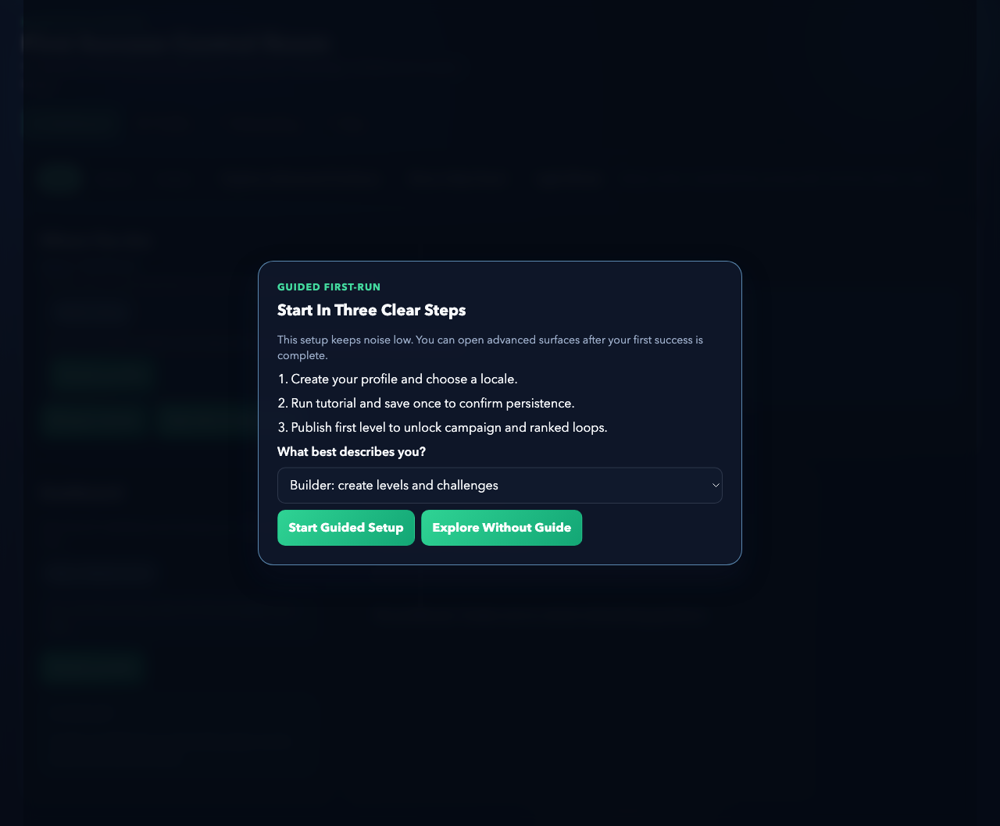
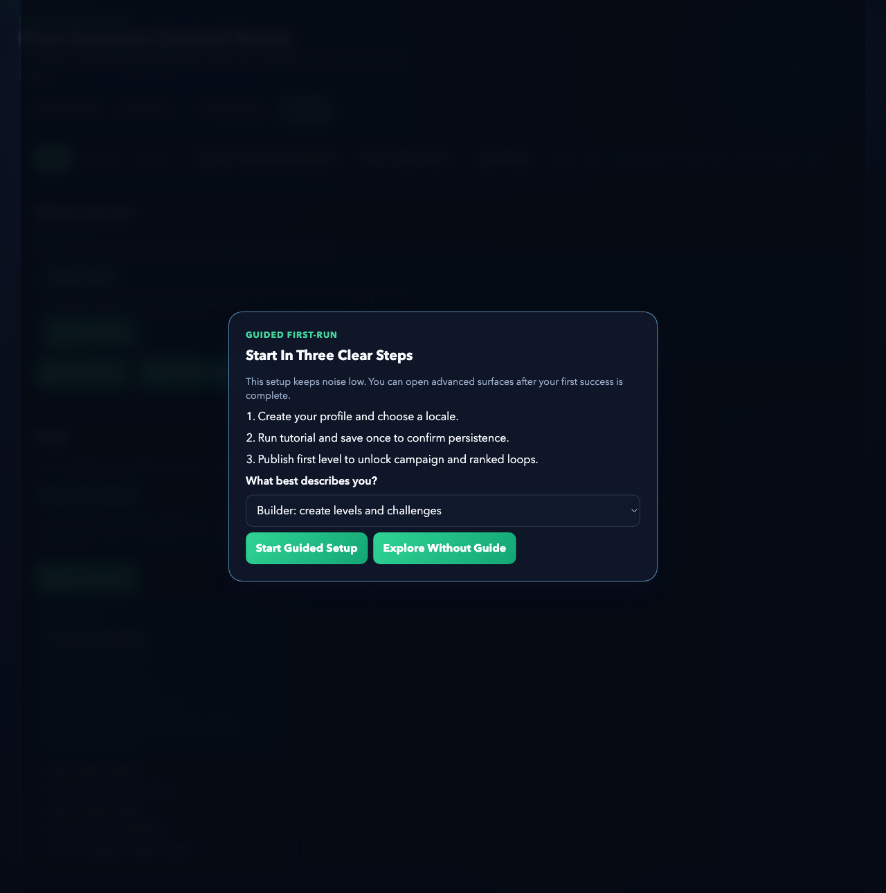

# Runwright Web Runtime Walkthrough

*2026-02-23T15:25:35Z by Showboat dev*
<!-- showboat-id: 39d9d232-ef10-4d69-851e-09c5058f49f3 -->

Runwright runtime walkthrough generated on 2026-02-23T15:25:35Z.

```bash
curl -sS http://127.0.0.1:4242/v1/health
```

```output
{"ok":true,"schemaVersion":"1.0","persistence":"json-ledger-v2"}
```

```bash
curl -sS http://127.0.0.1:4242/v1/release/readiness
```

```output
{"total":35,"ready":35,"pending":0,"matrix":[{"id":"RX1","title":"Game client shell readiness","ready":true,"evidence":"GET /"},{"id":"RX2","title":"Unified game-state contract","ready":true,"evidence":"RuntimeStateSchema validation"},{"id":"RX3","title":"Account/auth/profile progression","ready":true,"evidence":"POST /v1/auth/signup"},{"id":"RX4","title":"Save/load + cloud sync conflict policy","ready":true,"evidence":"POST /v1/saves"},{"id":"RX5","title":"First-10-minute onboarding arc","ready":true,"evidence":"GET /v1/onboarding/:profileId"},{"id":"RX6","title":"Adaptive tutorial overlays + hints","ready":true,"evidence":"GET /v1/tutorial/hints"},{"id":"RX7","title":"Failure/recovery UX matrix","ready":true,"evidence":"GET /v1/help + HTTP error payloads"},{"id":"RX8","title":"Progression economy balancing framework","ready":true,"evidence":"GET /v1/analytics/funnel"},{"id":"RX9","title":"Multi-phase boss encounter system","ready":true,"evidence":"GET /v1/liveops/season"},{"id":"RX10","title":"Replay + ghost challenge sharing","ready":true,"evidence":"GET /v1/analytics/funnel"},{"id":"RX11","title":"Challenge authoring templates","ready":true,"evidence":"POST /v1/ugc/levels"},{"id":"RX12","title":"Procedural generation quality constraints","ready":true,"evidence":"zod request validation"},{"id":"RX13","title":"Adaptive difficulty guardrails","ready":true,"evidence":"GET /v1/tutorial/hints"},{"id":"RX14","title":"Co-op session orchestration","ready":true,"evidence":"POST /v1/coop/rooms/join"},{"id":"RX15","title":"Friends/party/invite flow","ready":true,"evidence":"POST /v1/social/friends"},{"id":"RX16","title":"Ranked authoritative scoring model","ready":true,"evidence":"POST /v1/ranked/submit"},{"id":"RX17","title":"Anti-cheat/anti-tamper safeguards","ready":true,"evidence":"createRankedDigest + digest validation"},{"id":"RX18","title":"Seasonal LiveOps control system","ready":true,"evidence":"GET /v1/liveops/season"},{"id":"RX19","title":"UGC moderation and publish review flow","ready":true,"evidence":"POST /v1/moderation/report"},{"id":"RX20","title":"UGC discovery/rating surfacing","ready":true,"evidence":"GET /v1/ugc/discover"},{"id":"RX21","title":"Telemetry event schema coverage","ready":true,"evidence":"POST /v1/telemetry/events"},{"id":"RX22","title":"Analytics dashboard feed contract","ready":true,"evidence":"GET /v1/analytics/funnel"},{"id":"RX23","title":"Crash diagnostics and incident envelopes","ready":true,"evidence":"POST /v1/crash/report"},{"id":"RX24","title":"Performance budget enforcement surfaces","ready":true,"evidence":"Runtime endpoint-level payload limits"},{"id":"RX25","title":"Game-feel/cinematic timing controls","ready":true,"evidence":"Telemetry cadence + liveops metadata"},{"id":"RX26","title":"Accessibility feature pack","ready":true,"evidence":"PATCH /v1/profiles/:id/preferences"},{"id":"RX27","title":"Localization readiness pack","ready":true,"evidence":"profile locale support"},{"id":"RX28","title":"Offline/degraded network policy","ready":true,"evidence":"GET /v1/network/policy"},{"id":"RX29","title":"Abuse reporting workflow","ready":true,"evidence":"POST /v1/moderation/report"},{"id":"RX30","title":"QA device/locale/latency matrix","ready":true,"evidence":"GET /v1/qa/matrix"},{"id":"RX31","title":"Staged rollout + rollback runbook","ready":true,"evidence":"GET /v1/release/readiness"},{"id":"RX32","title":"On-call operations playbook","ready":true,"evidence":"GET /v1/help"},{"id":"RX33","title":"App-store release pack checklist","ready":true,"evidence":"GET /v1/release/readiness"},{"id":"RX34","title":"Legal/compliance readiness bundle","ready":true,"evidence":"GET /v1/help"},{"id":"RX35","title":"Closed beta + balancing gate","ready":true,"evidence":"GET /v1/analytics/funnel"}]}
```

Web runtime entry shell with guided onboarding and mode navigation.

```bash {image}
/Users/jasonlovell/AI/Runwright/docs/demos/assets/runtime-home.png
```



Contextual help panel state captured for onboarding/recovery guidance evidence.

```bash {image}
/Users/jasonlovell/AI/Runwright/docs/demos/assets/runtime-help.png
```


